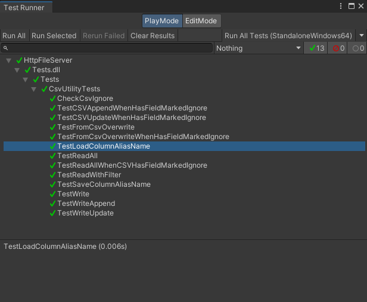
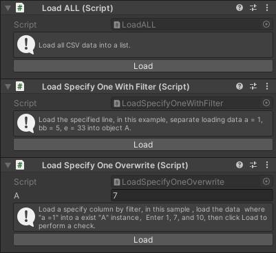

<a id="chinese">[English](#english)</a>
# CsvUtility 中文文档

此工具是我与 AI 共同打造的小巧单文件，可用于 CSV 读写。本工具接口丰富，易于使用。我的目标是和 JsonUtiliy 一样简单好用。

# 开发环境
Unity 2021.3.16f1

# 功能简介
1. 支持读取所有行到对象
2. 支持读取指定行到对象 
3. 支持将指定对象更新到 csv
4. 支持将指定对象新增到 csv。
5. 支持 overwrite 方式加载 csv 数据到对象
6. 支持使用 [CsvIgnoreAttribute] 标记不需要处理的字段。
7. 支持使用 [ColumnAttribute] 为字段指定别名，csv数据中的列名无需与字段名一致。
8. 理论上支持所有 .net 开发情景中使用（仅在 Unity 开发、测试）

# 使用方法

>1. 读取 csv 文件内容到指定的对象列表 

```csharp
var result = CsvUtility.Read<DisplayConfiguration>(testCsvPath);
```

>2. 将指定的对象列表存储成 csv 文件

```csharp
 var data = new List<DisplayConfiguration>
 {
     new DisplayConfiguration { index = 2, size_x = 4.5f, size_y = 4.9f, width = 1922, height = 1082 },
     new DisplayConfiguration { index = 3, size_x = 5.5f, size_y = 5.9f, width = 1923, height = 1083 }
 };
 CsvUtility.Write(data, testCsvPath);

```

>3. 更新给定的对象中的数据

 ```csharp
    var index = 1;
    var target = new DisplayConfiguration() { index = index };
    CsvUtility.FromCsvOverwrite(testCsvPath, target, v=>v.index == index);
```


>4. 根据指定的对象更新  csv 数据

```csharp
 var index = 1;
 var target = new DisplayConfiguration { index = index, size_x = 4.5f, size_y = 4.9f, width = 1925, height = 1085 };
 CsvUtility.Write(target, testCsvPath, v=>v.index == index, KeyinType.Update);
```

>5. 根据指定的对象新增 csv 数据

```csharp
//新增数据，会在 csv 的最后一行新增一行数据，如果指定的字段的值在 csv 中已经存在，则会抛出异常
 var index = 4;
 var target = new DisplayConfiguration { index = index, size_x = 1.1f, size_y = 6.6f, width = 1928, height = 1088 };
 CsvUtility.Write(target, testCsvPath, v=>v.index == index, KeyinType.Append);
 ```

>6. 获取 csv 指定数据并返回一个对象 

```csharp
var result = CsvUtility.Read<DisplayConfiguration>(testCsvPath, v =>v.index == 1);
```

>7. 支持通过 [CsvIgnoreAttribute ] 标记不需要处理的字段 

```csharp
 public class DisplayConfiguration
 {
        [CsvIgnore]
        public string name; // name 将不会保存到 csv 中
        public int index;
 }
```

> 8. 支持通过 [ColumnAttribute] 为字段指定别名

```csharp
 public class DisplayConfiguration
 {
		[Column("aliasname")]
		public string name; // csv 中的列名为 aliasname
		public int index;
 }
```


>如果数据量过大，为避免主线程卡死，操作可以尝试在 Task 中进行。


# 示例
请使用 upm 导入示例项目，示例项目中包含了上面提到的使用情景对应的示例代码。
将功能划分为保存、加载、更新、新增，每个功能对应一个系列的示例情景，如表格所示。
只需要点击对应的按钮即可运行示例代码，示例代码的运行结果会在控制台中打印出来。同时部分测试还会定位到 csv 文件。

|保存|加载|更新|新增|
|:---:|:---:|:---:|:---:|
|||||

# 单例测试
为保证工具的稳定性，我编写了单例测试，测试用例覆盖了工具的所有功能，测试用例的代码在 CsvUtility/Tests/文件夹下，测试结果如下图所示。




<a id="english">[简体中文](#chinese)</a>
# CsvUtility-For-Unity

This tool is a compact single file co-created by me and AI for CSV read/write. It has a rich interface and is user-friendly. My goal is to make it as easy to use as JsonUtiliy.

# Development Environment
Unity 2021.3.16f1

# Function Introduction
1. Supports reading all rows to an object
2. Supports reading specified rows to an object
3. Supports updating specified objects to csv
4. Supports adding specified objects to csv.
5. Supports loading csv data into an object in overwrite mode
6. Supports using [CsvIgnoreAttribute] to mark fields that do not need to be processed.
7. Supports using [ColumnAttribute] to specify aliases for fields, so that the column names in the csv data do not have to match the field names.
8. Theoretically supports all .net development scenarios (only developed and tested in Unity)

# Usage

>1. Read csv file content to specified object list

```csharp
var result = CsvUtility.Read<DisplayConfiguration>(testCsvPath);
```

>2. Store the specified object list as a csv file

```csharp
 var data = new List<DisplayConfiguration>
 {
     new DisplayConfiguration { index = 2, size_x = 4.5f, size_y = 4.9f, width = 1922, height = 1082 },
     new DisplayConfiguration { index = 3, size_x = 5.5f, size_y = 5.9f, width = 1923, height = 1083 }
 };
 CsvUtility.Write(data, testCsvPath);

```

>3. Update the data in the given object

 ```csharp
    var index = 1;
    var target = new DisplayConfiguration() { index = index };
    CsvUtility.FromCsvOverwrite(testCsvPath, target, v => v.index == index );
            
```


>4. Update csv data based on the specified object

```csharp
//Update data, will find the correct item that predicate matched, and then update the data of that row
 var index = 1;
 var target = new DisplayConfiguration { index = index, size_x = 4.5f, size_y = 4.9f, width = 1925, height = 1085 };
 CsvUtility.Write(target, testCsvPath, v => v.index == index, KeyinType.Update);
```

>5. Add csv data based on the specified object

```csharp
//Add data, will add a new line of data at the end of the csv. If the value of the specified field already exists in the csv, an exception will be thrown
 var index = 4;
 var target = new DisplayConfiguration { index = index, size_x = 1.1f, size_y = 6.6f, width = 1928, height = 1088 };
 CsvUtility.Write(target, testCsvPath,  v => v.index == index , KeyinType.Append);

```

>6. Get the data of the specified row according to the specified field and value and return an object 

```csharp
var result = CsvUtility.Read<DisplayConfiguration>(testCsvPath, v => v.index == 1);
```

>7. Support marking fields that do not need to be processed through [CsvIgnoreAttribute] 

```csharp
 public class DisplayConfiguration
 {
        [CsvIgnore]
        public string name; // name will not be saved to csv
        public int index;
 }
```

>8. Support specifying aliases for fields through [ColumnAttribute]

```csharp
 public class DisplayConfiguration
 {
		[Column("aliasname")]
		public string name; // The column name in csv is aliasname
		public int index;
 }
```


>If the data volume is too large, in order to avoid the main thread from being stuck, operations can be attempted in Task.


# Example
Please import the example project using upm. The example project contains example code corresponding to the usage scenarios mentioned above.

The functions are divided into save/load/update/append line and each function corresponds to a series of example scenarios as shown in the table.

Just click on the corresponding button to run the example code and the result of running the example code will be printed out in the console.

At the same time some tests will also locate to csv file.

|Save|Load|Update|Append Line|
|:---:|:---:|:---:|:---:|
|||||

# Unit Test
To ensure tool stability I wrote unit tests covering all tool functions.
The test case code is located under CsvUtility/Tests/ folder and test results are shown below.

